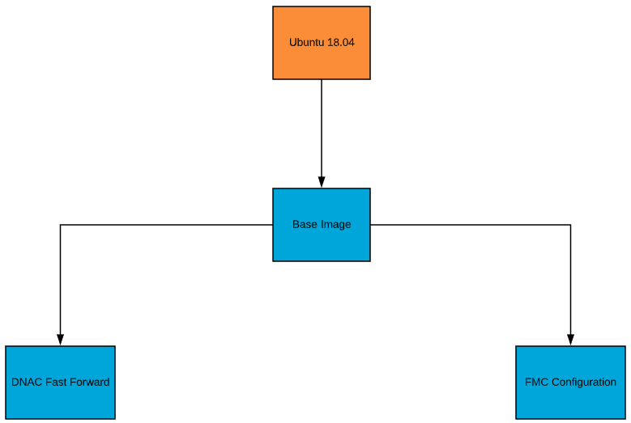
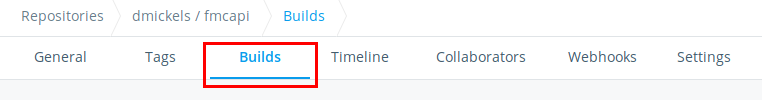
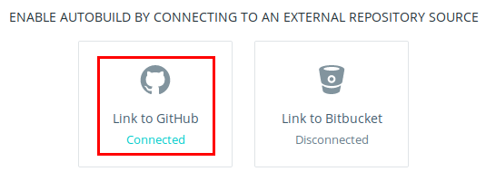
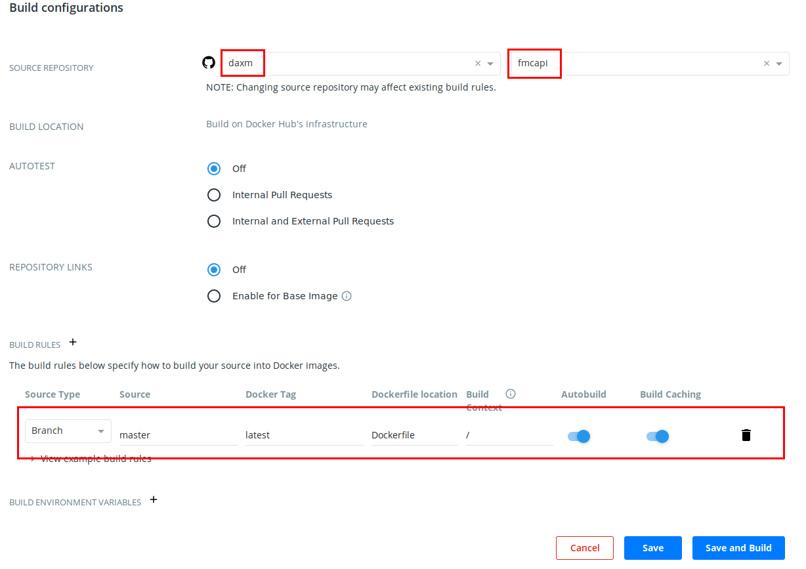

# Continuous Deployment for Cisco DNA Center and FMC Programming via API
The title alone is daunting, I know.  But don't worry, this tutorial is geared to show you what that all is and what it means.

## Table of Contents
* [Objective](#objective)
* [Requirements](#requirements)
* [Workflow Setup](#workflow-setup)
* [Write and Test Code](#write-and-test-code)


## Objective
Learn a process for automatically updating deployment scripts that configure Cisco's DNA Center and FMC products.


## Requirements
1.  [Github account](http://github.com)  (Note: At the moment DockerHub only integrates with GitHub, otherwise you could
 alternatively use a GitLab account.)
2.  [DockerHub account](http://hub.docker.com)
3.  Docker Desktop (Windows/MAC) or equivalent on Linux.
  * [Windows Download](https://hub.docker.com/editions/community/docker-ce-desktop-windows)
  * [MAC Download](https://hub.docker.com/editions/community/docker-ce-desktop-mac)  (Note: I don't have a MAC to test so YMMV.)
  * Linux (Ubuntu): (After installing reboot or log out and then back in.)
  ```bash
    sudo addgroup --system docker
    sudo adduser <username> docker
    sudo snap install docker
  ```
4.  At a minimum the ability to read/understand [Dockerfile files](https://docs.docker.com/engine/reference/builder/) 
and [Python](https://docs.python.org/3/) scripts.


## Workflow Setup

### Create/Fork git repositories to hold your code and docker config files
In your GitHub account you'll need a repository (or multiple repositories) to hold your Dockerfile configuration files
and your API scripts.  In this tutorial we will have several repositories as we've built modularity into our design.

Here is a list of repositories we are using and why they are separated:
1.  [Dockerfile and API scripts](https://github.com/daxm/sdapov)  We decided to put all our Dockerfiles in one repository.

The negative aspect to this design is that each time a commit is pushed to GitHub it will trigger a rebuild of all the 
Docker Hub images hosted in this repository.

2. [Postman Scripts](https://github.com/ankanani/sdapovfastforward-postman)  These scripts are maintained by one developer
and used by multiple projects so we decided to separate them into their own git repository.

One of the positive reasons for splitting this out is that we can commit/push new Postman files to this repository and 
it won't trigger rebuilds of the Docker Hub images.  Since this code is independent of the Docker Hub image this means
we will need to update the code inside the Docker container at "boot" of that container.  More about this later.

### Create Docker Hub repositories to hold Docker images
Our design has multiple Docker Hub repositories (one for each Dockerfile).  However, there is no reason you couldn't have
a single Docker Hub repository and just "tag" each built image uniquely.  More about this in the next sub-section.

For our design we have 3 Docker Hub repositories:
1.  [Base Image](https://hub.docker.com/repository/docker/dmickels/sdapov-baseimage)  This Docker image will be called
by the other Docker images in our project.  The idea here is that we are setting up a general image that includes all the
tools/applications/services needed by any of our specific projects.  Using this a our source image for the sub-projects 
means that we can add new items to this image and they will "magically" show up in all our sub-projects.

2.  [DNA Center Fast Forward Scripts](https://hub.docker.com/repository/docker/dmickels/sdapov-fastforwardscripts)  This Docker
image will reference the Postman GitHub repository we discussed earlier to program a Cisco DNA Center.

3.  [FMC Configuration](https://hub.docker.com/repository/docker/dmickels/sdapov-fmcconfig)  This Docker image will
program an Cisco FMC via its API using only Python.

A Visual Workflow of Docker Images:



### Integrate Docker Hub repository with GitHub repository
Up to this point the set up is the "old" way.  You would write code and push it to a git repository.  Then others would
pull that code and make their deployment setup from it.  This next part is where the "Continuous Deployment" comes into play.

In this section we set up the ability for GitHub to signal Docker Hub to build new Docker images when there is a change 
in our GitHub repository.

### Configure Docker Hub repository to automatically build new images
In order to set up the continuous deployment aspect you need to have a Docker Hub repository built.  This isn't too hard
as you can click the "Create Repository +" button on your Docker Hub's repository page.

Once the repository exists then you can access it and navigate to the "Builds" tab.



Automated builds can come from either GitHub or Bitbucket.  We choose GitHub.



My Docker Hub account has already been associated with my GitHub account so I cannot show you the integration process.
Suffice to say, you'll need to log into GitHub from Docker Hub.  Once you are logged in you can then select which of your
GitHub repositories should be linked with this Docker Hub repository.

Once the GitHub repository is selected more options will appear.  The key item is the "Build Rules" section.  Configure
this to match your setup.  In our case we used a different source branch than "master", we made the docker tag name be
different (to match the branch tag), and the "Build Context" need to have the full path to where the Dockerfile for this
Docker Hub repository was located.

 
 
 Once you have those parameters configured click "Save" and you are ready for automated builds of your GitHub repository!

## Write and Test Code
Our use case has two different sources for code.  One developer used Postman to develop the API calls to program Cisco
DNA Center, another programmer used the fmcapi Python module to develop the API calls to program Cisco FMC.  To avoid confusion
we will focus on just one of these for our examples.  Let's choose to follow the Postman developer's path since it is the
most complex (it has 2 GitHub repositories to maintain).

### Develop Docker Images and API Scripts
For this use case we are developing the "DNA Center Fast Forward" Docker image as shown in the graphic above.  This means we
need to build the Dockerfile and then the script that the Dockerfile will indicate should be run when it is booted.

#### Build Docker image to host your configuration scripts
The Dockerfile for this build is fairly simple.  This is because we are using the "base image" we've custom built as our
source.  As mentioned before, we did this so that all the software needed for our use cases can be updated in one place
and that would be automatically available to all our Docker images at next rebuild.  This means git, python3, etc. software
is ready to use.

From there we define some environment variables.  These variables are then used later in the file.

There are two git repositories for this image.  One contains the Postman files while the other contains the Python script
used to access the Postman files.  Though it may not make sense right now why we split them it will once we discuss the
Python script.  So, clone in the two repositories.

If there are any special Python modules needed install them now.  (Technically we could have put this in the "base image")
Dockerfile but we wanted to avoid possible module collisions between our different images sourcing from the base image.)

Finally run the Python script.

```text
FROM dmickels/sdapov-baseimage:selfservelabs-latest
MAINTAINER Dax Mickelson (dmickels@cisco.com)

# Configure Script and GIT variables
ENV CODE_REPO https://github.com/daxm/sdapov.git
ENV POSTMAN_REPO https://github.com/ankanani/sdapovfastforward-postman
ENV GIT_BRANCH selfservelabs
ENV WORK_DIR /usr/src/app
ENV SCRIPT_PATH $WORK_DIR/sdapov/docker/fastforward
ENV PYTHON_SCRIPT sdapovfastforward.py

# Clone repos.
WORKDIR $WORK_DIR
RUN git clone -b $GIT_BRANCH $CODE_REPO
RUN git clone -b $GIT_BRANCH $POSTMAN_REPO

# Install Python modules needed for this script.
RUN python3 -m pip install --no-cache-dir -r $SCRIPT_PATH/requirements.txt

# Run script.
WORKDIR $SCRIPT_PATH
CMD python3 $PYTHON_SCRIPT
```

#### Write/Build script for configuring DNA Center or FMC
The Python script used to access the Postman files and then run them is a bit long.  So instead of posting the contents
in whole I'm going to break up the file and discuss the pieces.  You can see the [file here](https://github.com/daxm/sdapov/blob/selfservelabs/docker/fastforward/sdapovfastforward.py).

Nothing too fancy in the beginning of the script.  Basically we are importing the Python modules we need and configuring
some "global" variables.
```python
import os
import sys
import subprocess
import git

POSTMAN_REPO = "https://github.com/ankanani/sdapovfastforward-postman"
GIT_BRANCH = "selfservelabs"

TOP_LEVEL_DIR = "/usr/src/app"
SCRIPT_WORK_DIR = f"{TOP_LEVEL_DIR}/sdapov/docker/fastforward"
SCRIPT_WORK_DIR_POSTMAN = f"{TOP_LEVEL_DIR}/sdapovfastforward-postman"
POSTMAN_COLLECTION_FILTER = "postman_collection"
POSTMAN_ENVIRONMENT_FILTER = "postman_environment"
```

From there we define two methods that will be called within the main() method.

The verify_continuation() method just prompts the user whether they want to continue or not.

The make_selection() method is used to filter the Postman files to display on those relevant to the item being requested.
```python
def verify_continuation():
    while True:
        a = input("Would you like to continue? [y/n] ")
        if a.lower() in ["yes", "y"]:
            break
        elif a.lower() in ["no", "n"]:
            print("Exiting...")
            sys.exit(0)
        else:
            print("Input y or n.")


def make_selection(postman_option):
    # search for postman collection/environment and ask the user to choose one
    postman_files = [
        f
        for f in os.listdir(SCRIPT_WORK_DIR_POSTMAN)
        if os.path.isfile(os.path.join(SCRIPT_WORK_DIR_POSTMAN, f))
        and postman_option in f
    ]
    if len(postman_files) > 0:
        print("Files:")
        count = 0
        for f in postman_files:
            count += 1
            print(f"\t{count} - {f}")
    else:
        print("Warning: Could not find any Postman files.")
        sys.exit(1)

    if len(postman_files) == 1:
        # There is only one option so just go with it.
        return postman_files[0]
    else:
        while True:
            try:
                a = int(input(f"Choose an option: [1-{len(postman_files)}] "))
                selected_postman_file = postman_files[a - 1]
                print(f"You selected the {selected_postman_file}.\n")
                # verify_continuation()
                return selected_postman_file

            except Exception as e:
                print(f"Invalid option.  Error: {e}")
```

The main() method does a ```git pull``` to grab the latest version of the Postman files.  (This is why we performed the 
```git clone``` in the Dockerfile.  We only need to do a ```git pull``` here and not check to see if it exists and then
either "pull" or "clone" depending on that.)

After selecting the collection and environment options (using the make_selection() method) we ask the user if they want
to continue.  If so, then we run the Postman scripts, via a node.js program called newman.

```python
def main():
    print(f"Updating local repo of Postman files.")
    repo = git.cmd.Git(SCRIPT_WORK_DIR_POSTMAN)
    repo.pull()

    # search for postman collections and ask the user to choose one
    selected_postman_collection_file = make_selection(postman_option=POSTMAN_COLLECTION_FILTER)

    # search for postman environments and ask the user to choose one
    selected_postman_environment_file = make_selection(postman_option=POSTMAN_ENVIRONMENT_FILTER)

    # Now lets run the "newman"
    print(
        f"Time to run fast forward scripts.\n"
        f"\tPOSTMAN COLLECTION: {selected_postman_collection_file}\n"
        f"\tPOSTMAN ENVIRONMENT: {selected_postman_environment_file}\n"
    )
    verify_continuation()

    print("Executing API calls now...")
    cmd = [
        f"newman run {SCRIPT_WORK_DIR_POSTMAN}/{selected_postman_collection_file} "
        f"-e {SCRIPT_WORK_DIR_POSTMAN}/{selected_postman_environment_file} "
        f"-k"
    ]
    subprocess.call(cmd, shell=True)

    print("\n\nReview the output of the API calls to ensure they were all successful.")
    sys.exit(0)


if __name__ == "__main__":
    main()
```

#### Commit/Push code to GitHub repository
Assuming you wrote the Dockerfile, the Postman scripts, and the Python script on your local computer you can now ```git push```
that code to your GitHub repository.  Once that process completes Docker Hub will be signalled to trigger an automated build
using the new changes in the git repository.

Once that build is complete (you can monitor its progress from the Docker Hub respository Build page) you can try running
your Docker image as a container!

### Test/Run Docker Container Containing API Scripts
Once Docker Hub has built an image you need to pull that image down to whereever you plan on running the container and run
that container.  The "desktop" you use will need to have Docker installed and also, in the case of the example scripts
discussed above, have access to a Cisco DNA Center server (since that is where these API calls are going to be sent).

Use the `docker pull <image>` command to pull down the latest version of your Docker image.
As an example, I'd use the following to pull the latest DNA Center Fast Forward image down to my computer:
```bash
docker pull dmickels/sdapov-fastforwardscripts:selfservelabs-latest
```

Once the image is local you can use the `docker run <image>` command to run the container (that will then start running
the Python script).
In my example that would be:
```bash
docker run -i --name test --rm dmickels/sdapov-fastforwardscripts:selfservelabs-latest
```

Technically I could just run the `docker run` command, without the `docker pull` command.  However, this would not check
Docker Hub to see if the image had any changes.  So, the first time I did this it would work as expected but then if I made
changes to the image on Docker Hub the next time I run the `docker run` command (without the `docker pull`) it wouldn't
update the source image and only run the "old" version.

Note:  The options used in the above `docker run` example are explained here:
* **-i**        Means to run the container in "interactive" mode.  This means you can send it commands via your CLI.
* **--name**    Gives the container a name.  This is useful if you need to stop a running container because you can just use 
the `docker stop <name>` command instead of need to figure out the container's image ID or its automatic name (which 
changes each new run).
* **--rm**      This option indicates to the container that it should destroy itself once it has stopped running.  I do this
to ensure that when I run a new container that I'm not grabbing an "old" version of that container.

### Iterate
In the example above I've provided a "finished product" view.  However, this code wasn't written in a day (nor was it 
correct the first time it was run).  Rinse, repeat until the Docker container does what you want it to.
